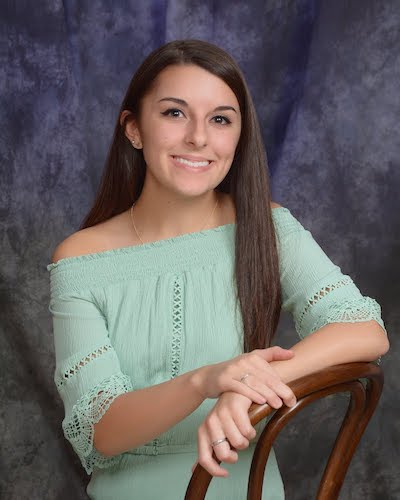
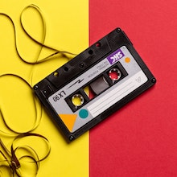
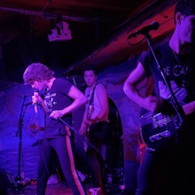

<!-- <!DOCTYPE HTML> -->
<html>
<head>
  <meta charset=utf-8>
  <!-- <title>Sarah V. Braddock</title>
   -->
</head>
<body>
  <header>
  <h1>Sarah V. Braddock</h1>
  <h5>Cell: (321)482-3457</h5>
  <h5>E-mail: svbraddock@gmail.com</h5>
  <h5>Linkedin: www.linkedin.com/in/sarahbraddock</h5>
    
  </header>

<h1><u>Recently Published Work</u></h1>
<article>
<h3>January 2020 Playlist</h3>

Start the new year off right.

<a href="https://svbraddock.weebly.com/playlists/jan2020">Read More</a>

</article>

<article>
<h3>Bad Nerves Talks FIDLAR, New Music, & Their Biggest Inspirations</h3>

Bad Nerves caught the eye of UK punks with the release of their first single, "Daydreaming." From line-up changes to a few more years of experience under their belt, the band has perfected the essence of garage punk rock with their catchy hooks and wired stage presence.

<a href="https://www.wvum.org/blog/2019/9/26/john-and-will-of-bad-nerves-talk-fidlar-new-music-amp-their-biggest-inspirations">Read More</a>

</article>

<article>
<h3>Extinction Rebellion Protests Take Over London</h3>

Moving into their second week of protest in London, Extinction Rebellion continues making headlines worldwide. This international movement utilizes non-violent civil disobedience in order to bring awareness to impending mass extinction and social collapse.

<a href="https://metiza.com/culture/extinction-rebellion-protests-take-over-london/">Read More</a>

</article>
<main>
  <h1><u>Qualifications</u></h1>
<h2>Education</h2>

<strong>University of Miami</strong>

Bachelor of Communications, May 2021

Major in Journalism

Minors in Advertising and Creative Writing

<h2>Experience</h2>
<h4><strong>MN2S International Music and Talent Agency Miami, FL Copywriting Intern:</strong> January 2020 - Present</h4>
<ul>
  <li>Assigned to write biographies for clients and feature pieces for the blog</li>
  <li>Corresponded with other interns through Google Sheets</li>
  <li>Utilized AP Style and SEO formatting guidelines</li>
</ul>

<h4><strong>WVUM The Voice of the University of Miami, Coral Gables, FL Blog Staff Member: </strong> August 2017 - Present</h4>
<ul>
  <li>Sent to cover local concerts and interact with venue contacts professionally</li>
 <li>Wrote concert reviews in a timely manner to ensure continued support from venues</li>
</ul>

<h4><strong>Metiza Magazine, Seattle, WA Remote Copywriting Editorial Intern, Social Media Coordinator: </strong> May 2018 - Dec. 2019</h4>
<ul>
  <li>Responsible to pitch and write two articles per week for online publication</li>
<li>Coordinated, through application Asana, with other interns</li>
<li>Given responsibility of Facebook and Twitter social media platforms during second semester interning</li>
<li>Designed and scheduled posts for every published article through applications Easil and Later</li>
</ul>

<h4><strong>Patti and Herbert Wellness Center, Coral Gables, FL Fitness Room Assistant: </strong>February 2019 - Present</h4>
<ul>
<li>Resolved conflict regarding enforcement of fitness room policies</li>
<li>Assisted patrons with questions and concerns</li>
</ul>
</main>
<section>
<table>
  <tr>
    <th>Honors and Activities</th>
    <th>Skills</th>
  </tr>
  <tr>
    <td> The National Society of Collegiate Scholars, Alpha Lambda Delta Honors Fraternity</td>
    <td>Adobe InDesign, Illustrator</td>
  </tr>
  <tr>
    <td>Golden Key National Honor Society Provost Honor Roll, Dean's List </td>
    <td>WordPress, LumaFusion,Asana</td>
  </tr>
</table>
</section>
<footer>
  <nav>
<h2><u>Author Pages:</u></h2>
  <ul>
    <li><a href="https://www.wvum.org/blog?author=5a958770e2c4834ea828a11c">WVUM</a></li>
    <li><a href="https://svbraddock.weebly.com">Svbraddock</a></li>
    <li><a href="https://metiza.com/author/sarahbraddock/">Metiza</a></li>
  </ul>
  </nav>

<small>All Images in the Public Domain or Owned By @Svbraddock</small>

  </footer>
</body>
</html>
